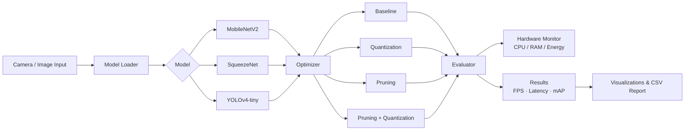

# Edge AI Object Detection

Real-time object detection on low-power devices like Raspberry Pi — comparing lightweight AI models for speed, accuracy, and efficiency.


---

## Why this project

Running AI on a laptop or cloud GPU is easy. Running it on a $50 Raspberry Pi, in real time, is a completely different problem — every millisecond and megabyte counts. This project answers a practical question: **which lightweight model actually performs best on real edge hardware, and which optimization technique gives you the most speed without wrecking accuracy?**

It benchmarks 3 models × 4 optimization techniques = **12 full experiments**, each measured on real metrics: FPS, latency, accuracy, model size, energy use, and memory footprint.

## How it works



## Models & Optimizations

| Model | Approach | Why it's included |
|---|---|---|
| **MobileNetV2** | Depthwise separable convolutions | Industry-standard efficient architecture |
| **SqueezeNet** | Fire modules, very small parameter count | Smallest footprint of the three |
| **YOLOv4-tiny** | Lightweight YOLO variant | Real-time detection with bounding boxes |

Each model is tested under **4 conditions**:
- **Baseline** — no optimization, reference performance
- **Quantization** — post-training INT8 quantization
- **Pruning** — 50% structured sparsity
- **Combined** — pruning followed by quantization

## Metrics tracked

- 🚀 **FPS** — throughput
- ⏱️ **Latency (ms)** — per-frame inference time
- 🎯 **mAP** — detection accuracy
- 📦 **Model size (MB)** — storage footprint
- 🔋 **Energy (Joules)** — power efficiency
- 🖥️ **CPU / RAM usage** — resource overhead

## Quick Start

```bash
# 1. Clone the repository
git clone https://github.com/<your-username>/edge-ai-object-detection.git
cd edge-ai-object-detection

# 2. Run setup (installs dependencies, creates venv, prepares directories)
chmod +x setup.sh
bash setup.sh
source venv/bin/activate

# 3. Download pretrained models
python src/dataset_prepare.py --download-models

# 4. Run a single experiment
python src/main.py --model mobilenet --optimization baseline --mode single

# 5. Or run the full 12-experiment suite
bash run_experiments.sh
```

### Real-time detection with your camera

```bash
python src/main.py --model squeezenet --optimization baseline --mode realtime --camera usb
```

## Hardware Requirements

- Raspberry Pi 4 (4GB RAM minimum, 8GB ideal)
- MicroSD card (32GB+, Class 10)
- Pi Camera v2 or USB webcam
- Heatsinks/fan recommended for sustained inference
- *(Optional)* Google Coral USB Accelerator for Edge TPU support

## Project Structure

```
.
├── src/
│   ├── main.py                 # CLI entry point
│   ├── model_loader.py         # Loads MobileNet / SqueezeNet / YOLO
│   ├── model_optimizer.py      # Quantization & pruning logic
│   ├── evaluator.py            # Benchmarking & metrics
│   ├── hardware_monitor.py     # CPU / RAM / energy tracking
│   ├── camera_capture.py       # Live camera input
│   ├── inference_with_boxes.py # Bounding box visualization
│   ├── main_experiment.py      # Runs the full 12-experiment suite
│   ├── visualization.py        # Generates comparison graphs
│   └── dataset_prepare.py      # Dataset & model downloads
├── models/                     # Saved model weights
├── datasets/                   # PASCAL VOC / CIFAR-10
├── output/                     # CSV results, graphs, logs, sample images
├── config.yaml                 # All experiment parameters
├── setup.sh                    # One-command environment setup
└── run_experiments.sh          # Runs all 12 experiments automatically
```

## Sample Output

```
========================================
Edge AI Object Detection Experiment
Raspberry Pi 4 - Lightweight CNN Evaluation
========================================
[INFO] Loading MobileNet...
[INFO] Applying quantization...
[INFO] Running benchmark...
[INFO] FPS: 28.4 | Latency: 35.2ms | mAP: 0.72
[INFO] Results saved to output/csv/experiment_results.csv
========================================
```

Results are saved as CSV data plus 8 comparison graphs (FPS, latency, accuracy-vs-speed, energy heatmap, model size, radar chart, FPS-over-time stability, and a confusion matrix).

## Tech Stack

`Python` · `TensorFlow Lite` · `OpenCV` · `NumPy` · `Raspberry Pi` · `Model Quantization` · `Model Pruning`

## License

MIT — see [LICENSE](LICENSE).
